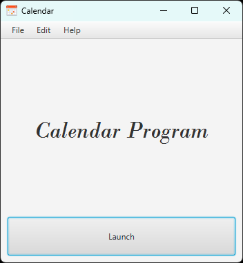
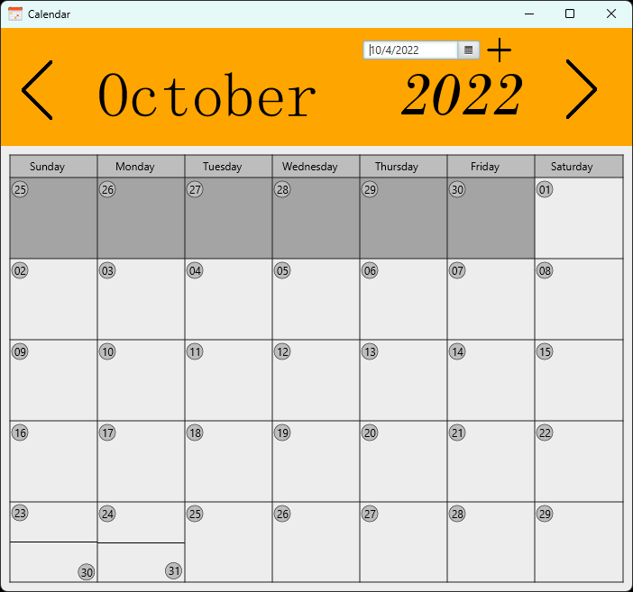
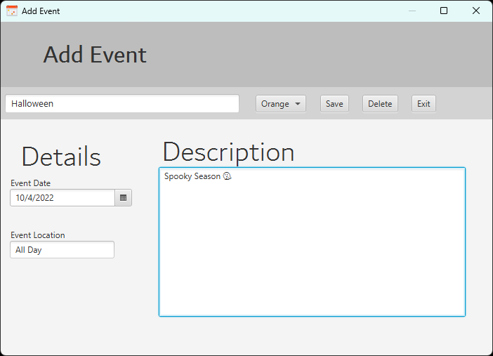

<!-- 1️⃣ PROJECT LOGO -->
 

  

<h3 align="center">Calendar Program</h3>

  

    A simple calendar program to stay organized
     
    <a href="https://github.com/SimpleLogix/Calendar/tree/master/src/edu/wit/comp1050"><strong>Explore the docs »</strong></a>
     
     
    <a href="https://github.com/github_username/repo_name">View Demo</a>
    ·
    <a href="https://github.com/SimpleLogix/Calendar/issues/new">Report Bug</a>
    ·
    <a href="https://github.com/SimpleLogix/Calendar/issues/new">Request Feature</a>
  

<!-- 2️⃣ ABOUT THE PROJECT -->
## About The Project

This project was created as part of my Sophomore Comp Sci II course. I wanted a minimal program to keep myself organized and on top of all of my tasks. 
I really wanted to create a program that I could benefit from personally and potentially use in my day-to-day life.
Of course, there are plenty of other calendar programs that exists and work perfectly fine. So, why reinvent the wheel?
Well, I thought it would be a fun challenge to build a utility-type program that seems simple at first but in actuallity has a plethora of intricate and complex parts.
  

The main features of this program are the month-to-month grid view displaying the current day, as well as any upcoming or previous events.
Users have the ability to add and edit events and click through the year to view or add any events in the upcoming months.
That's pretty much it.
  

This project was mostly a demonstration of my knowledge and understanding of Programming Fundamentals and the Java Language.

(<a href="#readme-top">back to top</a>)

### Built With

 - [![Eclipse][Eclipse]][Eclipse-url]
 - [![Java][Java]][Java-url]
 - [![JavaFX][JavaFX]][JavaFX-url]

(<a href="#readme-top">back to top</a>)

<!-- 3️⃣ Features -->
## Screenshots

  
  
  
   
  <figcaption align = "center"><b>Fig.1 - Launch Screen</b></figcaption>

  

  
  
    
    <figcaption align = "center"><b>Fig.2 - Home Screen</b></figcaption>

  

  
  
    
    <figcaption align = "center"><b>Fig.3 - A view of the events window</b></figcaption>
  

  

<!-- 4️⃣ Challenges -->
## Challenges

This is the first full program I wrote from scratch.
  
The main 2 challenges I ran into was (1) figuring out how to arrange the days in the correct order of the month and (2) changing the display when moving between months.
  
To solve the *first* issue, I used the DATE class to grab the current ISO date and using an [algorithm](https://cs.uwaterloo.ca/~alopez-o/math-faq/node73.html) was able to extract the day of the week.
Looking back at this, I could have used Java's built-in date formatter to extract the String form of the current Date. This would increase the program's effeciancy and load speeds.
  
As for the *second* issue, I opted to keep the same rendered display and simply change the text values of the days and the shades of the elements belonging to the current month.
The issue with this was the number of UI elements that needed to be updated each time the user changed months. Granted, it was a lot more effecient than reloading the same elements but with different values,
But this also meant needing to write 7 different case statements depending on what day of the week the 1st day of the month fell on (which dictates where the rest of the days fall on- very useful).
  
What this looks like is around 700 lines of code changing each element individually. I struggled with finding a data structure that could hold JavaFX elements and iterate through them as well, but my knowledge was
quite limited at the time. With the knowledge I have today, I would create my own iteratable data structure for JavaFX elements and save a couple hundred lines of code and hours of my time.
  
Overall, I am content with the amount of progress made in this project in the two weeks of working on it. 

(<a href="#readme-top">back to top</a>)

<!-- 5️⃣ ROADMAP -->
## Roadmap
*Who knows... maybe I'll come back and add on more to this*

- ✅ Display current day & month as well as next/prev months
- ✅ Add, edit, or remove custom events
  * [ ] Add the ability to color-code events
- ✅ Events saved and loaded locally

<!-- RESOURCES -->
## Resources

Lots of online tutorials and many references to the class slides. No other external sources or libraries were used.

(<a href="#readme-top">back to top</a>)

<!-- LICENSE -->
## License

Distributed under the MIT License. See `LICENSE.txt` for more information.

(<a href="#readme-top">back to top</a>)

<!-- CONTACT -->
## Contact

Walid Harkous- [@github](https://github.com/SimpleLogix) - harkouswalid@gmail.com

Project Link: [Calendar](https://github.com/SimpleLogix/Calendar)

(<a href="#readme-top">back to top</a>)

<!-- ACKNOWLEDGMENTS -->
## Acknowledgments
* Special thanks to *Professor* [Russel Adam](https://github.com/adamcrussell) for providing the necessary resources to bring this project to life 
* Big shout out to my *OG Advisor* [Charles Wiseman](https://github.com/cgwiseman) for the guidance before the beginning of this course

<!-- ACKNOWLEDGMENTS & REMARKS-->
## Closing Remarks

At the time of writing this, this project is no longer being maintained. It was a great learning opportunity. If you have a suggestion that would make this better, please fork the repo and create a pull request. You can also simply open an issue with the tag "enhancement".
 
Don't forget to give the project a star! Thanks again!

1. Fork the Project
2. Create your Feature Branch (`git checkout -b feature/AmazingFeature`)
3. Commit your Changes (`git commit -m 'Add some AmazingFeature'`)
4. Push to the Branch (`git push origin feature/AmazingFeature`)
5. Open a Pull Request

(<a href="#readme-top">back to top</a>)

<!-- MARKDOWN LINKS & IMAGES -->
<!-- https://www.markdownguide.org/basic-syntax/#reference-style-links -->

[Java]: https://img.shields.io/badge/Java-F89820?style=for-the-badge&logo=CoffeeScript&logoColor=white
[Java-url]: https://www.oracle.com/java/technologies/javase/jdk17-archive-downloads.html
[JavaFX]: https://img.shields.io/badge/JavaFX-0A6DB0?style=for-the-badge&logo=Gitee&logoColor=white
[JavaFX-url]: https://gluonhq.com/products/javafx/
[Eclipse]: https://img.shields.io/badge/Eclipse-2C2255?style=for-the-badge&logo=eclipse&logoColor=white
[Eclipse-url]: https://eclipseide.org/
